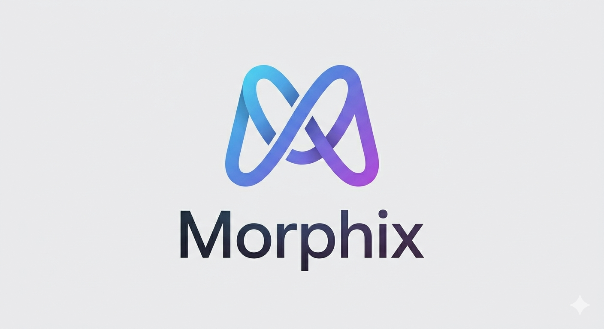

# 🎨 Morphix Restyle

**Restyle any website in seconds with a single prompt.**

I'm **Arzuparreta**, a musician passionate about technology and a Linux Systems Administrator. Morphix was born from a real need: as someone who spends hours in front of screens configuring servers, writing code, and creating music, I needed a fast way to adapt the web to my workflow without wasting time manually editing CSS.

With Morphix, you simply open the extension, describe the visual change you want, and the AI generates the necessary CSS/JavaScript instantly. It's the perfect union between **systems automation**, **artificial intelligence**, and **musical aesthetic sense**.

## ✨ What it does

- **Prompt-based Restyling**: Change the appearance of any website using natural language.
- **Smart Context**: Extracts a lightweight summary of the visible page so the model targets real elements.
- **Dynamic Injection**: Injects CSS and optional JavaScript when CSS isn't enough.
- **Live Preview**: Visualize changes before applying them permanently.
- **Style Management**: Save your restyles for a session, a specific URL, an entire domain, or to your personal library.
- **Multiple AI Providers**: Compatible with OpenRouter, Anthropic, OpenCode Go, Ollama, and any OpenAI-compatible endpoint.

## 🚀 Local Installation

This repository does not require a build step. It's free and open-source (FOSS) because I believe in privacy and user control over their tools.

1. Clone or download the repository.
2. Open Chrome or any Chromium-based browser.
3. Go to `chrome://extensions`.
4. Turn on **Developer mode**.
5. Click **Load unpacked**.
6. Select the `extension/` folder from this repository.

Don't forget to pin **Morphix Restyle** in the extensions menu for quick access!

## ⚙️ Setup your AI Provider

1. Open the extension options page.
2. Choose a provider.
3. Enter the model, base URL, API key, and any custom headers required by the provider.
4. Click **Test provider** to verify the connection.
5. Click **Save provider** to store it.

The default provider configuration is OpenRouter. Local providers such as Ollama can be used without an API key if they expose an OpenAI-compatible `/v1/chat/completions` endpoint.

## 🎯 How to use it

1. Visit any website you want to restyle.
2. Open Morphix Restyle from the browser toolbar.
3. Type a prompt, for example:
   - `Make this page calmer and easier to read.`
   - `Increase contrast and make buttons more obvious.`
   - `Hide distracting sidebars and widen the main article.`
4. Click **Apply**.
5. Review the result.
6. Decide whether to keep it for the session, the URL, the domain, or save it to your library.

If the result is not right, retry with the same prompt or discard it and try a more specific one.

## 🛡️ Privacy & Security

As a **SysAdmin**, security is my priority. Morphix stores provider settings and saved styles in Chrome extension storage. Your API keys and settings never leave your browser.

When you click **Apply**, Morphix sends to the selected AI provider:
- Your prompt.
- The current page URL and title.
- Viewport size.
- A compact summary of visible page elements (tags, stable identifiers, text snippets, and positions).

**By design**, Morphix does not send the full page HTML. You can see exactly what context is sent in each draft under **What we sent** in the popup.

## 🗂️ Project Layout

```text
extension/
  manifest.json                 Extension manifest
  background/service-worker.js   Message handling, provider calls, style injection
  content/extract.js             Visible page context extraction
  content/inject.js              Runtime style/script injection and route handling
  options/                       Provider settings and style library UI
  popup/                         Prompt, preview, and keep/discard UI
  shared/                        Providers, prompt, and storage helpers
```

## 🌱 Project Status

Morphix Restyle is an early local extension. Expect rough edges, especially on sites with strict Content Security Policies, heavy Shadow DOM usage, or very dynamic layouts.

**Contributions and fixes are welcome**. If you like the tool and want to collaborate, feel free to open an issue or a pull request!

## 🎼 Who's behind this?

I'm **Arzuparreta**, a musician who got into the world of Linux systems and automation. Morphix is a reflection of my way of working: efficient, creative, and slightly different from the usual.

- 🐧 **Linux SysAdmin**: I know how to keep things running and secure.
- 🎵 **Musician**: I understand the importance of aesthetics and visual rhythm.
- 🤖 **AI Builder**: I use AI to automate simple tasks and boost creativity.

If you like my work, give this repo a ⭐ and follow me to see how I build tools that mix these worlds.

[](https://github.com/Arzuparreta)
[](https://twitter.com/Arzuparreta)

---
*Building in public - Linux, Music, and Code.* 🚀
