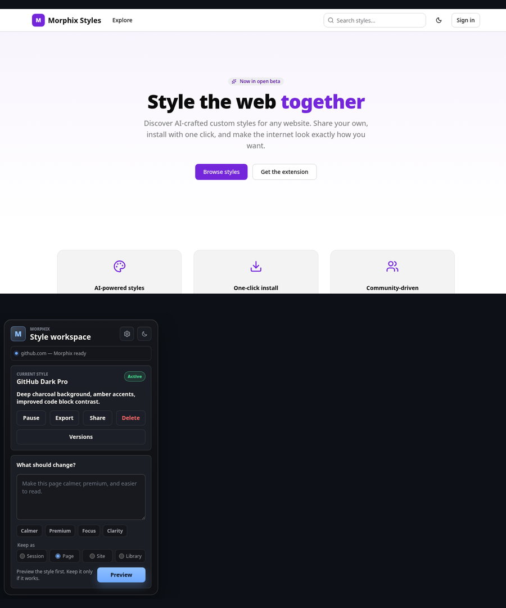

<div align="center">
  

  # Morphix

  **AI-powered website restyling. Share your styles with the world.**

  [](LICENSE)
  [](https://github.com/Arzuparreta/morphix)

  <br/>
  <a href="https://gallery-eight-beta.vercel.app">
    
  </a>

</div>

---

## What is Morphix?

Morphix is a browser extension that lets you **restyle any website using natural language** — describe what you want and AI generates the CSS and JavaScript. Export your styles as portable `.morphix` files, share them on the community gallery, or install styles created by others with one click.

Think of it as **Stylus meets Dribbble, powered by AI**. Instead of writing CSS by hand, you describe the change in plain English. Instead of hunting through forum threads for styles, you browse a visual gallery with screenshots, ratings, and one-click install.

### How it compares

| | Morphix | Stylish / Userstyles.org | Stylus |
|---|---|---|---|
| **Style creation** | AI prompt → instant CSS+JS | Manual CSS editor | Manual CSS editor |
| **Community gallery** | Visual cards, search, ratings | Forum-style list, heavy ads | No central gallery (3rd-party) |
| **Sharing format** | `.morphix` — full version history + AI context | Basic CSS snippet | UserCSS (CSS + metadata) |
| **Dark mode** | Default (gallery matches extension) | None | None |
| **Privacy** | Keys stay local, only page summary sent | Sold to analytics company | No tracking (FOSS) |
| **Install from web** | One click from gallery → extension | Manual copy-paste | Manual install URL |

## Features

### Browser extension
- **Prompt-based restyling** — Type what you want to change. Get CSS and JavaScript instantly.
- **Smart page context** — The AI sees element tags, classes, IDs, and text snippets, not your full page HTML.
- **Live preview** — Review changes before applying. Discard or keep with one click.
- **Version history** — Every edit becomes a version. Roll back to any previous state. Full conversation log preserved.
- **Per-site scoping** — Apply styles to a specific page, entire domain, or keep them in your library.
- **Multiple AI providers** — OpenRouter, Anthropic, Ollama, OpenCode Go, or any OpenAI-compatible endpoint.
- **Export/Import** — Share styles as `.morphix` files. Files include every version and the full AI conversation.
- **Share to Gallery** — Upload styles directly from the extension with automatic screenshots.
- **Community discovery** — See styles from the gallery that match the site you're browsing.

### Community gallery
- **Visual browsing** — Styles shown as cards with screenshots, ratings, and install counts.
- **Full-text search** — Search by name, description, tags, or target site.
- **Filter by tags** — Narrow by "dark", "minimal", "youtube", "github", and more.
- **Ratings & comments** — Rate styles 1–5 stars. Leave feedback. Threaded replies.
- **One-click install** — Click "Install" on the gallery, the extension imports the style automatically.
- **Author profiles** — See all styles by a creator. Build a following.

## Quick start — Extension

The extension loads directly from source — no build step required.

1. Clone the repository:
   ```bash
   git clone https://github.com/Arzuparreta/morphix.git
   ```
2. Open Chrome or any Chromium-based browser.
3. Go to `chrome://extensions` and enable **Developer mode**.
4. Click **Load unpacked** and select the `extension/` folder.
5. Pin **Morphix** in the toolbar.

### Configure an AI provider

1. Right-click the Morphix icon → **Options** (or click the gear in the popup).
2. Select a provider (OpenRouter is the default).
3. Enter your API key, model, and any custom headers.
4. Click **Test provider**, then **Save**.

### Create your first style

1. Visit any website.
2. Open the Morphix popup.
3. Type a prompt like:
   - `Make this page easier to read with better spacing and contrast.`
   - `Give this a dark theme with amber accents.`
   - `Remove the sidebar and widen the main content.`
4. Click **Preview**. Review the result.
5. Click **Apply style** to keep it.

### Firefox

Firefox requires a separate manifest because `background.service_worker` is not supported.

```bash
./scripts/build-firefox.sh
```
Then load `dist/firefox/manifest.json` as a temporary add-on in `about:debugging`.

## Quick start — Gallery

The gallery is a Next.js 14 app backed by Supabase (free tier). It takes about 5 minutes to set up.

### 1. Create a Supabase project

Go to [supabase.com](https://supabase.com) → New project (free tier). Note your project URL and anon key from **Settings → API**.

### 2. Run the database migration

Open the **SQL Editor** in your Supabase dashboard. Paste the contents of `supabase/migrations/001_schema.sql` and click **Run**.

This creates all tables, indexes, RLS policies, triggers, and the full-text search function.

### 3. Create storage buckets

Go to **Storage** in the Supabase dashboard. Create two public buckets:
- `screenshots`
- `avatars`

### 4. Configure and run the gallery

```bash
cd gallery
cp .env.local.example .env.local
# Edit .env.local with your Supabase URL and anon key
npm install
npm run dev
```

The gallery runs at `http://localhost:3000`.

### 5. Connect the extension to the gallery

1. Open the extension **Options** page.
2. Scroll to the **Gallery** section.
3. Enter your Supabase URL and anon key.
4. Enter your gallery email and password to sign in.
5. Click **Save & connect**.

### 6. Deploy (optional)

```bash
cd gallery
npx vercel deploy
```

Update `externally_connectable.matches` in `extension/manifest.json` with your deployed domain for the one-click install from gallery to work.

## Project structure

```
morphix/
├── extension/                   # Browser extension (Chrome/Firefox)
│   ├── manifest.json            # Extension manifest
│   ├── background/
│   │   └── service-worker.js    # Message routing, provider calls, injection
│   ├── content/
│   │   ├── extract.js           # Page context extraction for AI
│   │   └── inject.js            # CSS/JS injection engine
│   ├── popup/                   # Prompt, preview, style controls
│   ├── options/                 # Provider config, style library, gallery setup
│   └── shared/                  # Storage, prompts, providers, gallery client
├── gallery/                     # Community gallery web app
│   ├── app/                     # Next.js App Router pages + API routes
│   ├── components/              # UI components (cards, buttons, theme)
│   │   └── ui/                  # shadcn/ui primitives
│   └── lib/supabase/            # Types, queries, client config
├── supabase/
│   └── migrations/              # Database schema SQL
├── scripts/                     # Build scripts, tests
└── docs/                        # Design documents, branding
```

## Privacy

- **Your API keys never leave your browser.** They are stored in Chrome extension local storage.
- **Morphix sends a compact page summary** to the AI provider (element tags, classes, text snippets, viewport size) — not the full page HTML. You can inspect exactly what's sent under "What we sent" in the popup.
- **No analytics, no tracking, no data collection.** The extension has no telemetry. The gallery uses no third-party trackers.
- **Styles are stored locally** in your browser. Sharing to the gallery is opt-in.

## Contributing

Morphix is open source and built in public. Contributions are welcome.

- **Report bugs** — Open an issue with steps to reproduce.
- **Suggest features** — Open an issue with the `enhancement` label.
- **Submit PRs** — Fork, branch, and open a pull request. Keep diffs focused.
- **Share styles** — The gallery needs content. Upload your styles.

See [CONTRIBUTING.md](CONTRIBUTING.md) for guidelines (coming soon).

## License

Morphix is licensed under the **GNU General Public License v3.0** (GPL-3.0). See [LICENSE](LICENSE) for the full text.

Styles shared on the gallery are licensed under **CC BY-SA 4.0** by default. Authors may choose a more permissive license (MIT, CC0) on upload.

---

Built by [Arzuparreta](https://github.com/Arzuparreta).
